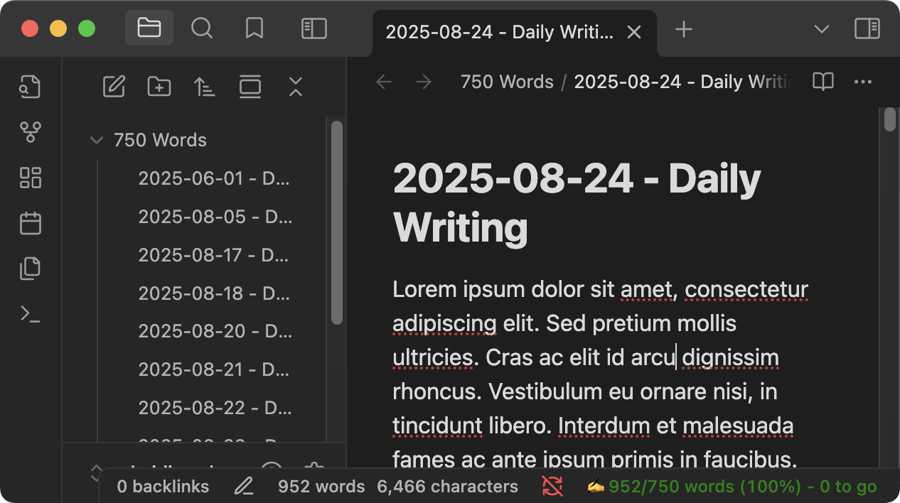
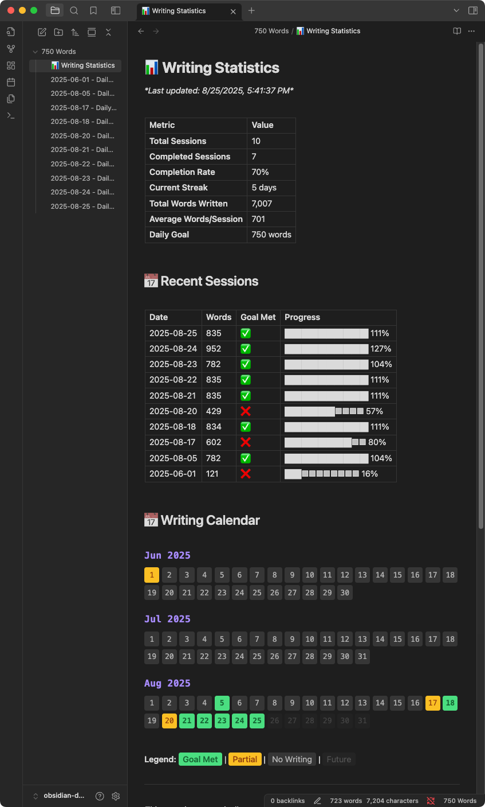

# Seven Fifty (Words) for Obsidian 📝
I agree with basically everything in this [thread](https://forum.obsidian.md/t/750-words/18000). It's been a few years so I thought, why not, I'll build this.

# How to use
## Commands
#### `Open Today's 750 Words`
- Opens the note associated with the current date
- If no notes exist creates the 750 words directory
- As you edit the words, the word count updates
> [!NOTE]
> The word count only updates when there are changes in the editor, so if the word count isn't accurate, make an edit then undo it

#### `View Writing Statistics`
- Generates (or updates) a *Writing Statistics 📊* file 
- Shows some stats, last 10 sessions, and writing calendar

## Settings
#### Word Count Goal
Set your daily word count targe
#### Writing Folder
Folder where daily writing files will be stored
#### Show Ribbon Icon
Display a ribbon icon in the left sidebar for quick access to daily writing

> [!WARNING]
> #### Timeout Seconds
> How many seconds before the writing timer pauses (for calculating writing rate

# Future Features
- [ ] WPM timer and stats
- [ ] integrate stats from [Novel Word Count](https://github.com/isaaclyman/novel-word-count-obsidian)
- [ ] be a seciton under [Daily Notes](https://help.obsidian.md/plugins/daily-notes)
- [ ] [sentiment analysis?](https://forum.obsidian.md/t/750-words/18000/5)
- [x] renaming the root directory
- [ ] update word count on opening a note
- [ ] command that updates the word count
- [ ] custom colors for the progress
- [ ] progress bar
- [ ] custom css for the
- [ ] other stat tracking (make an issue! 🙏)

+ any features you want to see feel free to throw up as issues and I'll evaluate if they should be implemented or not

# Special Thanks
@akaalias - the dangerzone code taught me basically everything I needed to know lol 😅

